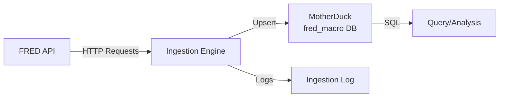

# FRED-Macro-Dashboard

> **Personal macroeconomic data infrastructure for tracking key indicators from the Federal Reserve Economic Data (FRED) API.**

**Version**: 0.1.0 (pre-MVP)
**Status**: 🟡 Phase 1 - Documentation
**Stack**: Python 3.10+ · DuckDB/MotherDuck · FRED API · UV

---

## What This Is

A personal data pipeline that fetches macroeconomic indicators from the FRED API and stores them in MotherDuck (cloud DuckDB) for analysis and tracking. This is both a practical tool for monitoring economic data and a learning project for exploring cloud data infrastructure patterns.

The "Big Four" core indicators:
- **FEDFUNDS** — Federal Funds Effective Rate
- **UNRATE** — Unemployment Rate
- **CPIAUCSL** — Consumer Price Index (All Urban Consumers)
- **GDPC1** — Real GDP

---

## Why Build This?

**The Problem:**
- Economic data is scattered across sources
- Manual downloads are tedious and error-prone
- Historical context requires tracking over years
- Data gets revised frequently (especially GDP)

**Learning Objectives:**
- Master DuckDB and MotherDuck for cloud data storage
- Build production-grade ETL patterns (backfill, incremental, upsert)
- Practice API integration with rate limiting
- Design extensible config-driven data pipelines

---

## Quick Start

### Prerequisites

- **Python 3.10+** ([Download](https://www.python.org/downloads/))
- **uv** package manager ([Install](https://github.com/astral-sh/uv))
- **MotherDuck account** (free tier) — [Sign up](https://motherduck.com/)
- **FRED API key** (free) — [Get key](https://fred.stlouisfed.org/docs/api/api_key.html)

### Installation

```bash
# Clone repository
git clone https://github.com/connorkitchings/FRED.git
cd FRED

# Install dependencies
uv sync

# Set environment variables
export MOTHERDUCK_TOKEN="your_token_here"
export FRED_API_KEY="your_api_key_here"
```

### First Run

```bash
# Initialize database schema
uv run python -m src.fred_macro.setup

# Backfill 10 years of data
uv run python -m src.fred_macro.ingest --backfill

# Query data
uv run python -m src.fred_macro.query --series UNRATE --last 12
```

---

## Architecture Overview



**Key Components:**
1. **FRED API Client** — Fetches time series data with rate limiting
2. **Ingestion Engine** — Handles backfill and incremental modes
3. **MotherDuck Storage** — Cloud DuckDB database with upsert logic
4. **Series Catalog** — YAML config defining indicators to track

📖 **Full architecture details**: [`docs/architecture/system_overview.md`](docs/architecture/system_overview.md)

---

## Key Indicators

### Tier 1: Core Indicators (MVP)
The "Big Four" — essential macro tracking:

| Series ID | Indicator | Frequency | Category |
|-----------|-----------|-----------|----------|
| FEDFUNDS | Federal Funds Rate | Monthly | Financial Markets |
| UNRATE | Unemployment Rate | Monthly | Labor Market |
| CPIAUCSL | Consumer Price Index | Monthly | Prices/Inflation |
| GDPC1 | Real GDP | Quarterly | Output/Income |

### Tier 2: Extended Indicators (Post-MVP)
Additional tracking (20-30 series):
- Housing: Building Permits, Housing Starts, Case-Shiller Index
- Consumption: Retail Sales, Personal Spending
- Manufacturing: Industrial Production, Capacity Utilization
- Trade: Trade Balance, Exports, Imports

### Tier 3: Deep Dive (Future)
Specialized indicators (40+ series) — sector-specific analysis

📊 **Full indicator catalog**: [`docs/data/dictionary.md`](docs/data/dictionary.md)

---

## Project Status

**Current Phase**: Documentation and Planning
**Next Milestone**: MVP — Big Four indicators ingestion

### What's Working
- ✅ Project structure and documentation
- ✅ Indicator architecture defined (3 tiers)
- ✅ Data model designed

### What's Next
- [ ] Database connection and schema setup
- [ ] FRED API client implementation
- [ ] Backfill/incremental ingestion logic
- [ ] MVP validation with Big Four indicators

📅 **Full roadmap**: [`docs/implementation_schedule.md`](docs/implementation_schedule.md)

---

## Documentation

### Getting Started
- [Project Charter](docs/project_charter.md) — Vision, scope, users (PRD-style)
- [MVP Definition](docs/mvp_definition.md) — Clear success criteria
- [Technical Requirements](docs/technical_requirements.md) — System specs

### Data & Architecture
- [Data Dictionary](docs/data/dictionary.md) — Indicators and schema
- [FRED API Documentation](docs/data/sources/fred_api.md) — Data source guide
- [System Overview](docs/architecture/system_overview.md) — Architecture diagram
- [Architecture Decisions](docs/architecture/adr/) — ADRs for key choices

### Development
- [Implementation Schedule](docs/implementation_schedule.md) — Task tracking
- [Development Standards](docs/development_standards.md) — Coding guidelines
- [Testing Guide](docs/template_testing_guide.md) — Test strategy

### AI Assistance
- `.agent/CONTEXT.md` — AI agent entry point
- `.agent/skills/` — Reusable workflows
- `CLAUDE.md` / `AGENTS.md` — AI coding guidance

---

## Technology Stack

| Category | Technology | Notes |
|----------|------------|-------|
| Language | Python 3.10+ | Type hints, modern syntax |
| Database | DuckDB / MotherDuck | Cloud-accessible analytics database |
| Data Source | FRED API | Federal Reserve Economic Data |
| API Client | fredapi | Python wrapper for FRED |
| Config | PyYAML | Series catalog configuration |
| Package Mgmt | uv | Fast Python package manager |
| Testing | pytest | Unit and integration tests |

---

## Development Workflow

```bash
# Check branch (never work on main)
git branch

# Create feature branch
git checkout -b feat/your-feature

# Format and lint
uv run ruff format . && uv run ruff check .

# Run tests
uv run pytest

# Health check before commits
# Follow: .agent/workflows/health-check.md
```

---

## Contributing

This is primarily a personal project, but contributions are welcome! Please:

1. Read the development standards: [`docs/development_standards.md`](docs/development_standards.md)
2. Create a feature branch (never work on `main`)
3. Follow the commit conventions
4. Run health checks before opening a PR

---

## License

MIT License — See [LICENSE](LICENSE) for details.

---

## Acknowledgments

- **FRED API** — Federal Reserve Bank of St. Louis
- **MotherDuck** — Cloud DuckDB infrastructure
- **Vibe Coding Template** — Project structure and AI workflows

---

**Built with**: Vibe Coding methodology
**Last Updated**: 2026-02-12
**Project Status**: Pre-MVP Documentation Phase
This product uses the FRED® API but is not endorsed or certified by the Federal Reserve Bank of St. Louis.
