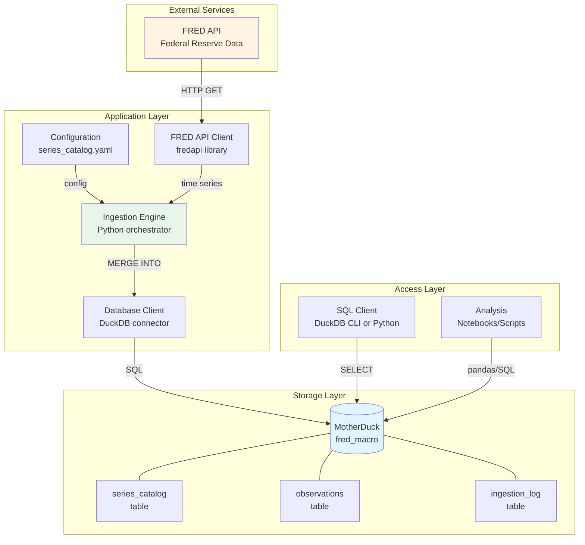
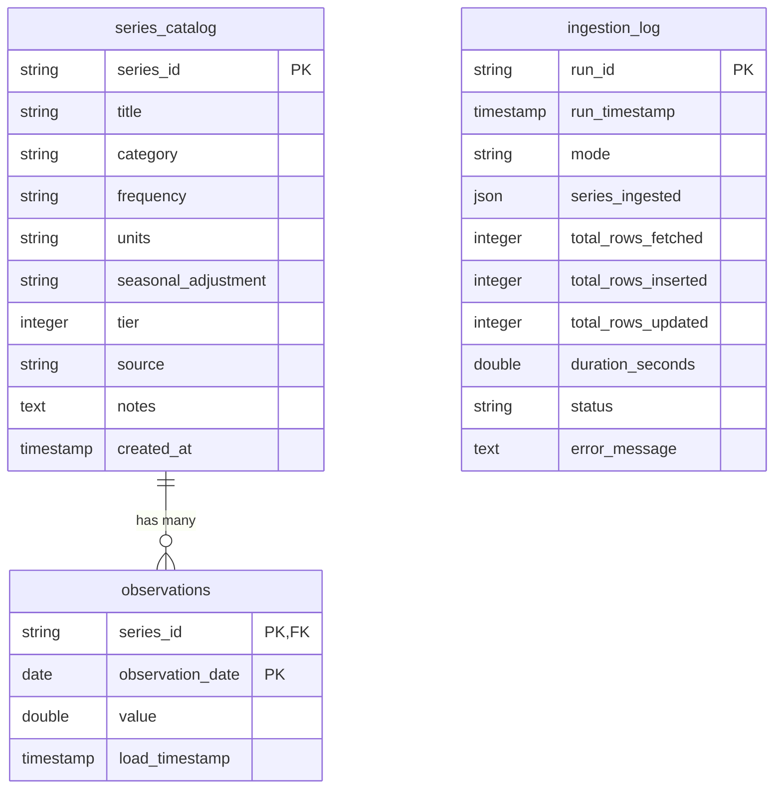

# System Overview

> **High-level architecture for FRED-Macro-Dashboard data pipeline.**

---

## Purpose

This document provides a comprehensive view of the system architecture, component interactions, data flows, and technology decisions for the FRED-Macro-Dashboard project.

---

## Architecture Principles

1. **Simplicity**: Straightforward ETL pipeline without unnecessary complexity
2. **Cloud-First**: Use MotherDuck for cloud-accessible data storage
3. **Config-Driven**: Adding new indicators requires only configuration changes
4. **Idempotent**: Safe to re-run ingestion without side effects
5. **Observable**: All operations logged for debugging and auditing

---

## System Architecture



---

## Component Descriptions

### 1. FRED API (External Service)

**Purpose**: Source of macroeconomic time series data

**Provider**: Federal Reserve Bank of St. Louis

**Interface**:
- REST API with JSON responses
- Rate limit: 120 requests/minute
- Free tier (no cost)

**Key Endpoints**:
- `series/observations`: Fetch time series data
- `series`: Get series metadata (optional in our design)

**Responsibility**:
- Provide authoritative economic data
- Handle data revisions (GDP, employment, etc.)
- Update series as new data is released

---

### 2. Configuration (series_catalog.yaml)

**Purpose**: Define which indicators to track

**Location**: `config/series_catalog.yaml`

**Format**: YAML with series metadata

**Schema**:
```yaml
series:
  - series_id: STRING          # FRED identifier
    title: STRING              # Human-readable name
    category: STRING           # Thematic category
    frequency: STRING          # D/W/M/Q/A
    units: STRING              # Measurement units
    seasonal_adjustment: STRING # SA/NSA/NULL
    tier: INTEGER              # 1/2/3
    source: STRING             # Original data source
    notes: STRING              # Interpretation guidance
```

**Responsibility**:
- Single source of truth for tracked indicators
- Enables adding series without code changes
- Documents indicator metadata

---

### 3. FRED API Client

**Purpose**: Wrapper around fredapi library with error handling

**Technology**: `fredapi` Python package

**Responsibilities**:
- Authenticate with FRED API using API key
- Fetch time series data for given date range
- Handle rate limiting (throttle to 1 req/sec)
- Retry on transient failures (exponential backoff)
- Convert API response to pandas DataFrame

**Key Methods**:
```python
def fetch_series(series_id: str, start_date: str, end_date: str) -> pd.DataFrame:
    """Fetch time series from FRED with error handling."""

def fetch_batch(series_ids: list[str], start_date: str, end_date: str) -> dict:
    """Fetch multiple series with rate limit throttling."""
```

---

### 4. Ingestion Engine

**Purpose**: Orchestrate data pipeline from FRED to MotherDuck

**Technology**: Python (3.10+)

**Responsibilities**:
- Load series catalog from YAML
- Determine date range (backfill vs. incremental mode)
- Fetch data from FRED via API client
- Transform data for database insertion
- Upsert data into MotherDuck (MERGE INTO)
- Log ingestion run details

**Modes**:
1. **Backfill**: Fetch 10 years of historical data (2016-01-01 to present)
2. **Incremental**: Fetch last 60 days (captures recent data + revisions)

**Key Methods**:
```python
def run_ingestion(mode: str, series_filter: list[str] = None):
    """Main ingestion orchestrator."""

def backfill_series(series_id: str):
    """Fetch full history for a series."""

def incremental_update(series_id: str):
    """Fetch recent data for a series."""
```

---

### 5. Database Client

**Purpose**: Execute SQL queries against MotherDuck

**Technology**: `duckdb` Python package

**Connection**:
```python
import duckdb
conn = duckdb.connect(f'md:fred_macro?motherduck_token={token}')
```

**Responsibilities**:
- Establish authenticated connection to MotherDuck
- Execute schema creation (CREATE TABLE IF NOT EXISTS)
- Execute upsert operations (MERGE INTO)
- Query data for validation

**Key Operations**:
- **Schema Setup**: Create tables if not exist
- **Upsert**: Insert new + update existing observations
- **Query**: Retrieve data for analysis

---

### 6. MotherDuck (Cloud Storage)

**Purpose**: Persistent, cloud-accessible data warehouse

**Technology**: MotherDuck (cloud DuckDB)

**Database Name**: `fred_macro`

**Tables**:
1. **series_catalog**: Metadata for each tracked indicator
2. **observations**: Time series data points
3. **ingestion_log**: Audit trail of all ingestion runs

**Advantages**:
- Cloud-accessible (query from any machine)
- SQL interface (standard DuckDB dialect)
- Fast analytics (columnar storage)
- Free tier sufficient for project size

**See**: [ADR-0002: Why MotherDuck](adr/adr-0002-motherduck.md)

---

### 7. SQL Client / Analysis Layer

**Purpose**: Query and analyze data

**Access Methods**:
- **DuckDB CLI**: Interactive SQL queries
- **Python**: pandas + duckdb connector
- **Jupyter Notebooks**: Exploratory analysis

**Example Queries**:
- Latest values for all indicators
- Year-over-year change calculations
- Cross-indicator correlations
- Time series visualizations

---

## Data Flow

### Backfill Mode (First Run)

```
┌─────────────────┐
│ 1. Load Config  │ Read series_catalog.yaml
└────────┬────────┘
         │
┌────────▼────────┐
│ 2. Initialize   │ CREATE TABLE IF NOT EXISTS
│    Schema       │ (series_catalog, observations, ingestion_log)
└────────┬────────┘
         │
┌────────▼────────┐
│ 3. Fetch Data   │ For each series:
│    (FRED API)   │   - GET series/observations (2016-01-01 to today)
│                 │   - Throttle: 1 req/sec
└────────┬────────┘
         │
┌────────▼────────┐
│ 4. Transform    │ Convert API response to DataFrame
│                 │ (date, value) for each series
└────────┬────────┘
         │
┌────────▼────────┐
│ 5. Upsert       │ MERGE INTO observations
│                 │ ON (series_id, observation_date)
└────────┬────────┘
         │
┌────────▼────────┐
│ 6. Log Run      │ INSERT INTO ingestion_log
│                 │ (run_id, timestamp, row_counts, duration)
└─────────────────┘
```

---

### Incremental Mode (Daily Updates)

```
┌─────────────────┐
│ 1. Load Config  │ Read series_catalog.yaml
└────────┬────────┘
         │
┌────────▼────────┐
│ 2. Fetch Recent │ For each series:
│    Data         │   - GET series/observations (last 60 days)
│    (FRED API)   │   - Throttle: 1 req/sec
└────────┬────────┘
         │
┌────────▼────────┐
│ 3. Upsert       │ MERGE INTO observations
│                 │ (inserts new, updates revisions)
└────────┬────────┘
         │
┌────────▼────────┐
│ 4. Log Run      │ INSERT INTO ingestion_log
└─────────────────┘
```

**Key Difference**: Incremental mode fetches only recent data (60-day window), reducing API calls and runtime.

---

## Database Schema

### Entity-Relationship Diagram



**Composite Keys**:
- `observations`: (series_id, observation_date) — Prevents duplicate observations

**Foreign Keys**:
- `observations.series_id` → `series_catalog.series_id`

**See**: [Data Dictionary](../data/dictionary.md) for complete schema documentation.

---

## Technology Stack

### Core Technologies

| Component | Technology | Version | Purpose |
|-----------|------------|---------|---------|
| **Language** | Python | 3.10+ | Primary programming language |
| **Database** | DuckDB | 0.10+ | Embedded analytics database |
| **Cloud Storage** | MotherDuck | N/A | Cloud DuckDB instance |
| **API Client** | fredapi | latest | FRED API wrapper |
| **Package Manager** | uv | 0.4+ | Dependency management |

### Supporting Technologies

| Component | Technology | Purpose |
|-----------|------------|---------|
| **Configuration** | PyYAML | Parse series catalog |
| **Data Manipulation** | pandas | DataFrame operations |
| **Environment** | python-dotenv | Load environment variables |
| **Testing** | pytest | Unit and integration tests |
| **Linting** | Ruff | Code quality |
| **Documentation** | MkDocs | Static site generation |

---

## Key Architectural Decisions

### ADR-0002: Use MotherDuck Instead of Local DuckDB

**Context**: Need persistent, cloud-accessible storage

**Decision**: Use MotherDuck (cloud DuckDB) instead of local file

**Consequences**:
- ✅ Access data from multiple machines
- ✅ Automatic backups
- ⚠️ Requires internet connection
- ⚠️ Token authentication needed

**See**: [ADR-0002](adr/adr-0002-motherduck.md)

---

### ADR-0003: Use MERGE INTO for Upsert Strategy

**Context**: FRED data gets revised (especially GDP)

**Decision**: Use SQL MERGE INTO for upsert on composite key

**Consequences**:
- ✅ Handles revisions automatically
- ✅ No duplicate rows
- ✅ Idempotent (safe to re-run)
- ⚠️ Slightly more complex SQL

**See**: [ADR-0003](adr/adr-0003-upsert-strategy.md)

---

### ADR-0004: Three-Tier Indicator Organization

**Context**: Want extensibility without overwhelming initial MVP

**Decision**: Organize indicators into Core (Tier 1), Extended (Tier 2), Deep Dive (Tier 3)

**Consequences**:
- ✅ Clear MVP scope (Tier 1 only)
- ✅ Obvious expansion path (Tier 2, then Tier 3)
- ✅ Config-driven additions
- ⚠️ Need to maintain tier classifications

**See**: [ADR-0004](adr/adr-0004-indicator-tiers.md)

---

## Deployment Architecture

### Development Environment

```
Local Machine
├── Python 3.10+ virtual environment (managed by uv)
├── .env file with tokens (MOTHERDUCK_TOKEN, FRED_API_KEY)
├── config/series_catalog.yaml
└── src/fred_macro/ (Python modules)
```

### Runtime Environment

```
Internet Connection
    ↓
FRED API (fred.stlouisfed.org)
    ↓
Local Python Process
    ↓
MotherDuck (motherduck.com)
```

**No Server Required**: This is a client-side application that runs on-demand.

---

## Security Considerations

### Credential Management

- **Environment Variables**: Store tokens in `.env` file (gitignored)
- **Never Commit**: Tokens and API keys never in source control
- **Token Rotation**: Periodically regenerate MotherDuck token

### Data Privacy

- **Public Data**: All FRED data is public; no privacy concerns
- **Access Control**: MotherDuck token controls database access

### API Security

- **HTTPS Only**: All API calls encrypted in transit
- **Rate Limiting**: Respect FRED rate limits (120 req/min)

---

## Scalability Considerations

### Current Scale

- **Series**: 4 (MVP) → 100 (future)
- **Observations**: ~400 (MVP) → ~100,000 (future)
- **Storage**: ~20KB (MVP) → ~10MB (future)
- **Daily Growth**: ~50 new rows/day

### Scalability Limits

| Resource | Current | Limit | Headroom |
|----------|---------|-------|----------|
| **MotherDuck Storage** | <1MB | 10GB | 10,000x |
| **MotherDuck Compute** | Minimal | 10GB | Ample |
| **FRED API Calls** | ~100/day | 120/min | 172,800/day theoretical |

**Conclusion**: Current architecture scales well beyond foreseeable needs.

---

## Monitoring & Observability

### Ingestion Logging

Every ingestion run is logged in `ingestion_log` table:

- **run_id**: Unique identifier
- **timestamp**: When ingestion started
- **series_ingested**: List of series processed
- **row_counts**: Fetched, inserted, updated
- **duration**: Runtime in seconds
- **status**: Success, partial, or failed

### Metrics to Track

- **Success Rate**: % of ingestion runs that succeed
- **Data Freshness**: Max age of observations by series
- **Storage Growth**: Total observations over time
- **API Performance**: Average fetch time per series

### Alerting (Future)

Post-MVP, consider alerting for:
- Ingestion failures
- Data staleness (no updates in expected timeframe)
- API errors exceeding threshold

---

## Future Enhancements

### Short-Term (Post-MVP)

1. **Tier 2 Indicators**: Expand to 20-30 series
2. **Data Quality Checks**: Range validation, anomaly detection
3. **Query Views**: Pre-defined views for common analyses
4. **Scheduling**: Automate daily ingestion (cron or Prefect)

### Medium-Term

1. **Web Dashboard**: Streamlit or similar for visualizations
2. **Alert System**: Notify on significant indicator changes
3. **Data Export**: CSV/Excel export functionality
4. **Historical Vintages**: Track point-in-time data snapshots

### Long-Term

1. **Multi-Source**: Integrate additional data providers (BLS, BEA direct)
2. **Forecasting**: Simple time series forecasting models
3. **API**: Expose data via REST API for other applications

---

## References

- [Project Charter](../project_charter.md) — Vision and scope
- [MVP Definition](../mvp_definition.md) — Success criteria
- [Technical Requirements](../technical_requirements.md) — Detailed specs
- [Data Dictionary](../data/dictionary.md) — Schema and indicators
- [FRED API Documentation](../data/sources/fred_api.md) — Data source guide

---

**Last Updated**: 2026-02-12
**Architecture Version**: 1.0 (MVP design)
**Status**: Documentation complete, implementation pending
