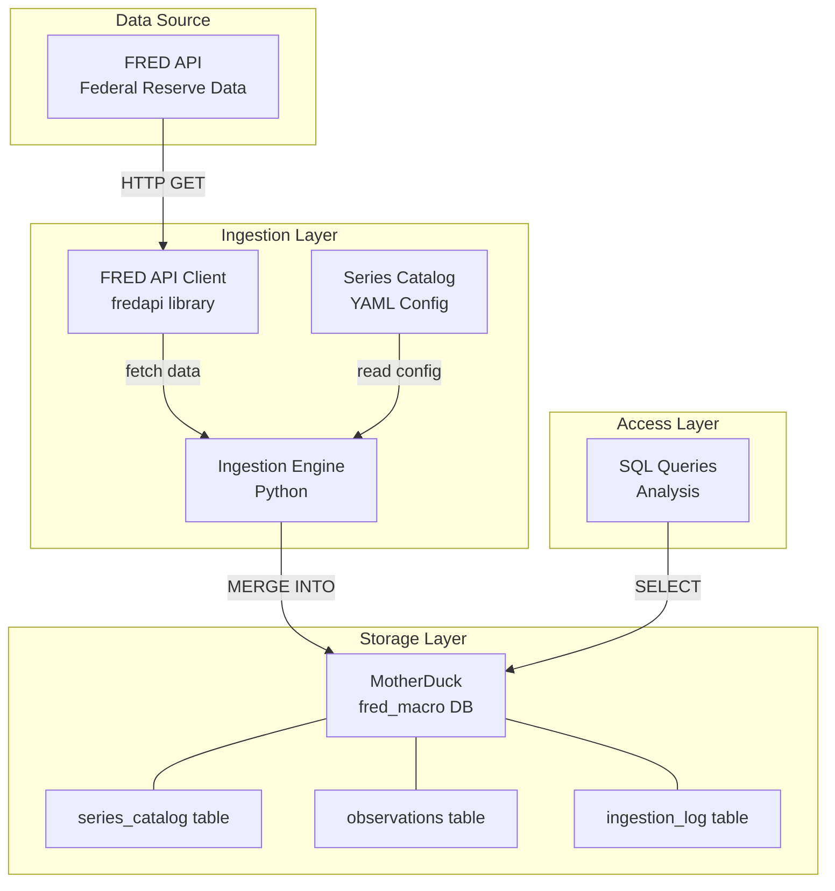

# Project Charter

> **Single source of truth for project goals, scope, and technical context.**
>
> This document should be updated as the project evolves, especially the **DECISION LOG**.

---

## Project Overview

**Project Name:** FRED-Macro-Dashboard

**Project Vision:** Build personal infrastructure for tracking macroeconomic indicators from the Federal Reserve Economic Data (FRED) API, creating a reliable pipeline from data source to cloud storage for analysis and learning.

**Technical Goal:** Deliver a working MVP by end of February 2026 with automated FRED → MotherDuck ingestion for the "Big Four" indicators, supporting both historical backfill and incremental updates.

**Repository:** https://github.com/connorkitchings/FRED

---

## Users & User Stories

### Primary Persona

**Target User:** Personal use (Connor Kitchings)

- **Name:** Connor (Me)
- **Role:** Developer / Data Enthusiast / Learner
- **Pain Points:**
  - Economic data is scattered and requires manual tracking
  - No historical context for current economic conditions
  - Data revisions (especially GDP) make tracking complex
  - Want to learn cloud data infrastructure patterns
- **Goals:**
  - Track key macro indicators in one place
  - Query historical data easily
  - Learn DuckDB, MotherDuck, and ETL patterns
  - Build extensible infrastructure for future expansion

---

### Core User Stories

**Story 1:** As a user, I want to run a single command to update my macro data so that I don't have to manually download CSVs.

- Priority: Must-have
- Acceptance: `uv run python -m src.fred_macro.ingest` fetches latest data

**Story 2:** As a user, I want to query 10 years of economic history so that I can analyze trends and patterns.

- Priority: Must-have
- Acceptance: SQL queries return complete historical data for Big Four indicators

**Story 3:** As a user, I want to easily add new indicators without writing code so that I can expand tracking over time.

- Priority: Should-have
- Acceptance: Adding a series to YAML config file automatically includes it in next ingestion

**Story 4:** As a developer, I want clear documentation so that I can understand the system after time away from the project.

- Priority: Must-have (learning project!)
- Acceptance: README and docs/ provide clear entry points and explanations

---

## Features & Scope

### Must-Have (MVP)

**Feature A:** MotherDuck database connection and schema setup

- User Story: Story 2
- Implementation: `docs/implementation_schedule.md` Phase 2
- User Impact: High — Foundation for everything else
- Details: Token-based auth, automated schema creation

**Feature B:** FRED API integration for Tier 1 indicators

- User Story: Story 1, Story 2
- Implementation: `docs/implementation_schedule.md` Phase 3
- User Impact: High — Core data fetching
- Details: Fetch FEDFUNDS, UNRATE, CPIAUCSL, GDPC1 with rate limiting

**Feature C:** Backfill mode (10 years historical data)

- User Story: Story 2
- Implementation: `docs/implementation_schedule.md` Phase 3
- User Impact: High — Historical context
- Details: Fetch start_date = 2016-01-01 to present

**Feature D:** Incremental mode (last 60 days)

- User Story: Story 1
- Implementation: `docs/implementation_schedule.md` Phase 3
- User Impact: High — Daily updates
- Details: Efficient updates without re-fetching all data

**Feature E:** Upsert logic for data revisions

- User Story: Story 1
- Implementation: `docs/implementation_schedule.md` Phase 3
- User Impact: High — Handle GDP revisions
- Details: MERGE INTO on (series_id, observation_date)

**Feature F:** Ingestion logging

- User Story: Story 4
- Implementation: `docs/implementation_schedule.md` Phase 3
- User Impact: Medium — Observability
- Details: Track run_id, timestamp, series, row counts

---

### Should-Have (Post-MVP)

**Feature G:** Tier 2 indicator expansion (20-30 series)

- Implementation: `docs/implementation_schedule.md` Phase 5
- Details: Housing, consumption, manufacturing, trade indicators

**Feature H:** Data quality checks

- Implementation: `docs/implementation_schedule.md` Phase 5
- Details: Missing value detection, anomaly alerts, range validation

**Feature I:** Query views for common analyses

- Implementation: `docs/implementation_schedule.md` Phase 5
- Details: YoY change, rolling averages, trend analysis views

---

### Out of Scope

These are explicitly **NOT** part of this project:

- Real-time streaming data updates
- Web dashboard or user interface
- Multi-user access and permissions
- Historical vintages tracking (point-in-time data)
- Forecasting or predictive models
- Data export to other formats (handled by SQL queries)
- Integration with trading or financial systems

---

## Architecture

### High-Level Summary

The system is a straightforward ETL pipeline: FRED API → Python ingestion script → MotherDuck database. The ingestion engine reads a YAML configuration file defining which series to track, fetches data via the FRED API, and upserts it into MotherDuck using DuckDB's SQL dialect. All ingestion runs are logged for observability.

### System Diagram

### Key Components

1. **FRED API Client**: Wrapper around `fredapi` library with rate limiting
2. **Series Catalog**: YAML file defining series_id, category, tier, etc.
3. **Ingestion Engine**: Orchestrates fetching and upserting data
4. **MotherDuck Database**: Cloud DuckDB instance (fred_macro)
5. **Schema**: Three tables (series_catalog, observations, ingestion_log)

### Data Flow

1. **Configuration Load**: Read `config/series_catalog.yaml`
2. **Mode Selection**: Backfill (10 years) or incremental (60 days)
3. **API Fetch**: Request data from FRED for each series
4. **Transform**: Convert API response to DataFrame
5. **Upsert**: MERGE INTO observations table (no duplicates)
6. **Logging**: Record run details in ingestion_log

---

## Technology Stack

| Category | Technology | Version | Notes |
|----------|------------|---------|-------|
| Language | Python | 3.10+ | Type hints, dataclasses |
| Database | DuckDB | 0.10+ | Embedded analytics database |
| Cloud Storage | MotherDuck | N/A | Cloud DuckDB (free tier) |
| Data Source | FRED API | v2 | Federal Reserve Economic Data |
| API Client | fredapi | latest | Python wrapper for FRED |
| Config Management | PyYAML | latest | Series catalog configuration |
| Package Management | uv | 0.4+ | Fast Python package manager |
| Testing | pytest | 8.x | Unit and integration tests |
| Linting | Ruff | 0.5+ | Fast Python linter and formatter |
| Documentation | MkDocs | 1.6+ | Static site documentation |

---

## Risks & Assumptions

### Key Assumptions

**Data Availability:** FRED API is reliable and free tier supports our usage pattern (120 requests/minute is more than sufficient for 50 series).

- Validation: Monitor API response times and error rates during MVP testing

**Cloud Storage:** MotherDuck free tier (10GB storage, 10GB compute) is adequate for this project size.

- Validation: Monitor storage usage; expected data size is <100MB for 10 years × 50 series

**Data Revisions:** GDP and other indicators get revised; upsert strategy handles this gracefully.

- Validation: Test with manually modified data to verify upsert overwrites correctly

**Learning Curve:** DuckDB and MotherDuck are learnable within project timeline.

- Validation: Complete MVP within 2-3 weeks as proof of concept

---

### Technical Risks

| Risk | Probability | Impact | Mitigation |
|------|-------------|--------|------------|
| FRED API rate limits hit during bulk backfill | Medium | Medium | Implement exponential backoff, throttle requests to 1/sec |
| MotherDuck connection issues | Low | High | Local DuckDB fallback option, retry logic with timeout |
| Data schema changes in FRED | Low | Medium | Validate API responses, log unexpected fields |
| Storage costs exceed free tier | Low | Low | Monitor usage, optimize schema if needed |
| Missing data for certain series | Medium | Low | Log warnings, continue with other series |
| Complex data revisions pattern | Medium | Medium | Start simple; iterate if real-world issues found |

---

## Decision Log

| Date | Decision | Context / Drivers | Impact / Follow-up |
|------|----------|-------------------|-------------------|
| 2026-02-12 | Use MotherDuck instead of local DuckDB | Need cloud-accessible storage for querying from multiple machines; MotherDuck offers cloud DuckDB with free tier | Requires token auth; see ADR-0002 |
| 2026-02-12 | Implement upsert strategy for observations | FRED data gets revised (esp. GDP); need to handle updates without duplicates | Use MERGE INTO SQL; see ADR-0003 |
| 2026-02-12 | Organize indicators into 3 tiers | Want extensibility without overwhelming initial MVP; clear expansion path | Tier 1 for MVP (4 series), Tier 2/3 for future; see ADR-0004 |
| 2026-02-12 | Use YAML for series catalog | Need human-readable config that's easy to extend without code changes | All series metadata in `config/series_catalog.yaml` |
| 2026-02-12 | Support backfill and incremental modes | Backfill for initial load, incremental for daily updates | Two modes: --mode backfill (10 years), --mode incremental (60 days) |
| 2026-02-12 | Track ingestion runs in dedicated table | Need observability and audit trail | ingestion_log table with run_id, timestamp, row_counts |
| 2026-02-12 | Python 3.10+ as minimum version | Need modern Python features (type hints, dataclasses, pattern matching) | No Python 3.9 support; CI enforces 3.10+ |

---

## Success Metrics

### MVP Success Criteria

See [`docs/mvp_definition.md`](mvp_definition.md) for detailed acceptance criteria.

**Key Metrics:**
- ✅ Big Four indicators ingested successfully
- ✅ 10 years historical data (400+ observations)
- ✅ Zero duplicates in database
- ✅ Ingestion logs created for every run
- ✅ Re-runs are idempotent (safe to repeat)

---

### Long-Term Success Indicators

- **Data Coverage**: 50+ indicators tracked (Tier 1 + Tier 2)
- **Data Quality**: <1% missing observations
- **Reliability**: 99%+ ingestion success rate
- **Usability**: Can add new series without code changes
- **Learning**: Clear understanding of DuckDB, ETL patterns, API integration

---

## Project Phases

### Phase 1: Documentation (Current)
**Status**: 🟡 In Progress
**Duration**: Week 1
**Deliverables**: Project charter, MVP definition, technical requirements, data dictionary

### Phase 2: Foundation
**Status**: ☐ Not Started
**Duration**: Week 1-2
**Deliverables**: Environment setup, database connection, schema creation

### Phase 3: Core Pipeline
**Status**: ☐ Not Started
**Duration**: Week 2-3
**Deliverables**: FRED API client, ingestion engine, backfill/incremental modes

### Phase 4: Testing & Validation
**Status**: ☐ Not Started
**Duration**: Week 3
**Deliverables**: Unit tests, integration tests, data validation, MVP sign-off

### Phase 5: Expansion (Future)
**Status**: ☐ Not Started
**Deliverables**: Tier 2 indicators, data quality checks, query views

---

## References

- **FRED API Documentation**: https://fred.stlouisfed.org/docs/api/fred/
- **MotherDuck Documentation**: https://motherduck.com/docs/
- **DuckDB Documentation**: https://duckdb.org/docs/
- **fredapi Library**: https://github.com/mortada/fredapi

---

**Last Updated**: 2026-02-12
**Document Status**: Active — MVP planning phase
**Next Review**: After MVP completion
